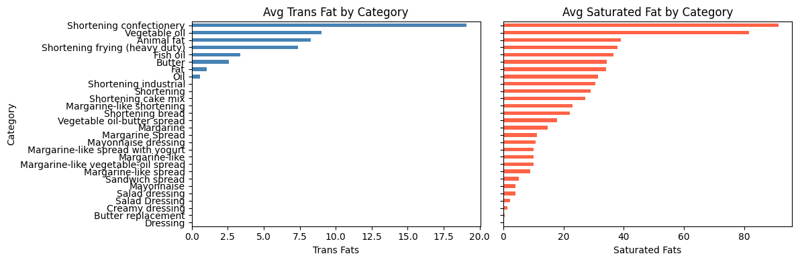
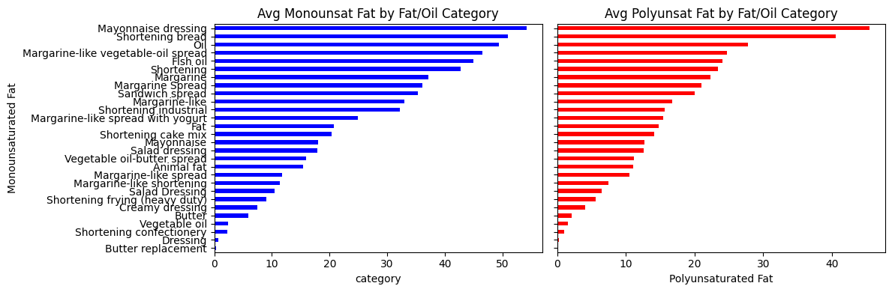
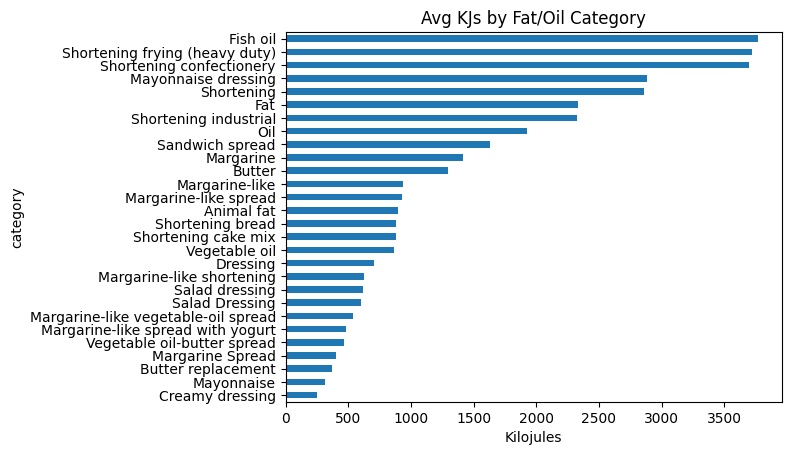

# Introduction
This project came about primarily for my deep love of food and cooking food. I chose to scrape data about fats and oils because fat is one of the core pillars of good cooking (along with salt, acid, and heat. Check out the [best cook book ever](https://www.saltfatacidheat.com/)!) I am constantly using different fats in the kitchen whether it's olive oil, pork lard, or vegetable oil. I wanted to look more deeply into fats and oils to better understand their nutrient values and see what I could learn.

# Motivating Question:
Which fats and oils are healthiest/unhealthiest for me?

# API Ethics and Considerations
Something I considered when looking for data to scrape was the availability and quality of this food data. There are thousands of websites that discuss foods nutritional value, but I wondered about potential biases and scientific authenticity affecting the data. That is why I decided to go to the [USDA's](https://fdc.nal.usda.gov/food-search?type=SR%20Legacy&SRFoodCategory=Fats%20and%20Oils) website. I knew a .gov would be credible and that if web scraping was allowed, that they would provide a public API.

Luckily, this was the case and I got an API key very quickly. I also made sure to visit their [robots.txt](https://fdc.nal.usda.gov/robots.txt) site that explained all bots can scrape anything on the site! (`User-agent: * Disallow:`) I knew I was good to go after that.

# API Methodology
My goal was to take raw JSON data from the API and turn it into a clean CSV file that lists various oils and their key nutrient values. This type of project is a good introduction to using APIs, handling nested JSON data, and cleaning it up with pandas.

> *Little caveat: The process of getting clean data from the USDA's API was very difficult! It took me several hours to figure out how to pull specifically from the fats and oils section. USDA obviously did not put lots of time into simplifying their API call processes.*

To start, I stored my personal API key in a local text file called `api.txt`. This keeps the key out of my code and away from version control systems like GitHub. The script opens that file, reads the key, and uses it to make authenticated API requests. I searched the database for the phrase “Fat and Oils” and looped through the first five pages of results, saving all the returned food items into a single list. Each page of data came back as JSON, which I converted into a pandas DataFrame.

Once the data was loaded, I filtered it down to only include foods from the “SR Legacy” dataset, which contains standardized reference data. I then removed columns I didn’t need, such as publication dates and brand information, to make the dataset simpler. The most important step was handling the `foodNutrients` column. Each row contained a list of nutrients stored as dictionaries, so I wrote a short function to look through that list and pull out specific nutrient values like calories, protein, saturated fat, trans fat, and sodium.

After extracting these values into their own columns, I replaced any missing data with zeros to keep things clean. Finally, I renamed a few columns, dropped unneeded columns, and exported everything to a new CSV file called `fatandoils.csv`. The end result is a clear, structured dataset that can be used for analysis or visualization.

If someone wanted to replicate this project, they’d just need to follow the process below:

1. Get an API key from the their desireed website 
2. Install pandas and requests
3. Read the key and query the API
4. Load the data into a DataFrame
5. Extract the needed information and export it

# EDA with Fats and Oils!

**Final Dataset Information:**

- Total Observations: 214
- Categorical Variables: 2
- Numerical variables: 8

**EDA Visuals:**

**Most Interesting EDA Highlights:**

- Margenine and Shortening Products consistently had high average amounts of trans and saturated fats (bad fats), but also had high average amounts of polyunsaturated and monounsaturated fats (good fats). Interesting that these products which are highly processed also seem to have relatively high amounts of the good fats as well

- Similarly, Animal fats which are not processed had high levels monounsaturated fats (good fats), but also had relatively high saturated fats (bad fats). 

- Fish oil had the highest amount of Kilojules per 100g than any other fat or oil at over 3700Kjs. Normally, I would expect natural foods to be low calorie and thus "healthy", but fishoil is extremely caloric notwithstanding it's high polyunsaturated fat content (good fat)

# Useful Links

- [USDA Site](https://fdc.nal.usda.gov/food-search?type=SR%20Legacy&SRFoodCategory=Fats%20and%20Oils)
- [USDA API Guide](https://fdc.nal.usda.gov/api-guide)
- [Seperate GitHub repo](https://github.com/logancchavez-cmyk/data-acquisition-blog)
- [Mayo Clinic Dietary Fat Inf](https://www.mayoclinic.org/healthy-lifestyle/nutrition-and-healthy-eating/in-depth/fat/art-20045550)
- [Salt, Fat, Acid, Heat Book](https://www.saltfatacidheat.com)

---
